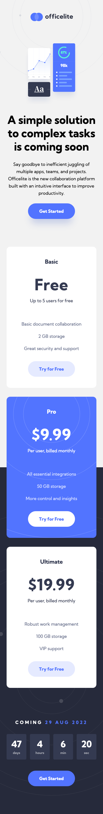
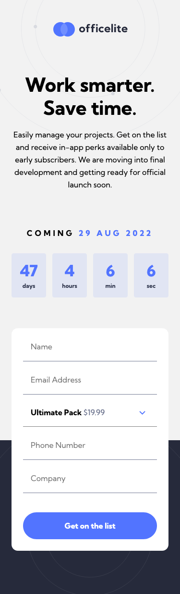
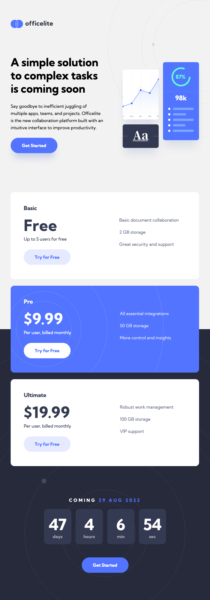
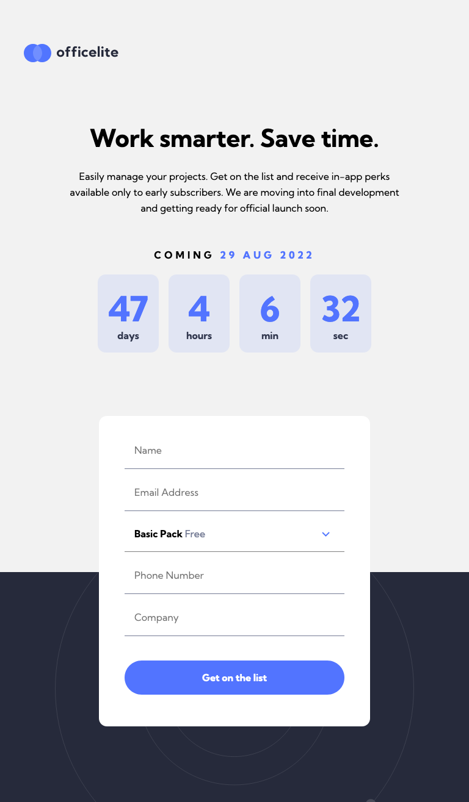
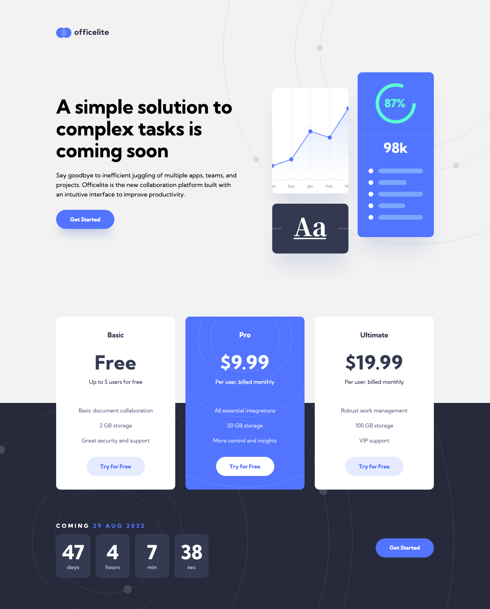
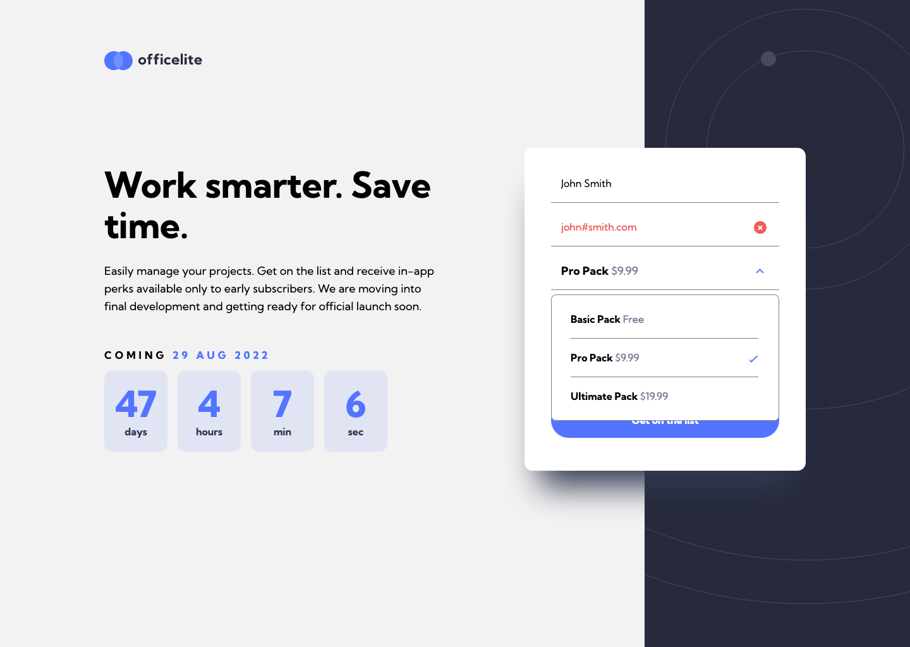

# Frontend Mentor - Officelite coming soon site solution

This is a solution to the [Officelite coming soon site challenge on Frontend Mentor](https://www.frontendmentor.io/challenges/officelite-coming-soon-site-M4DIPNz8g). Frontend Mentor challenges help you improve your coding skills by building realistic projects. 

## Table of contents

- [Overview](#overview)
  - [The challenge](#the-challenge)
  - [Screenshots](#screenshots)
  - [Links](#links)
- [My process](#my-process)
  - [Built with](#built-with)
  - [What I learned](#what-i-learned)
- [Author](#author)

## Overview

### The challenge

Users should be able to:

- View the optimal layout for the site depending on their device's screen size
- See hover states for all interactive elements on the page
- See error states when the contact form is submitted if:
  - The `Name` and/or `Email Address` fields are empty
  - The `Email Address` is not formatted correctly
- **Bonus**: See a live countdown timer that ticks down every second
- **Bonus**: See a custom-styled `select` form control in the sign-up form

### Screenshots

### Links

- Solution URL: [Frontend Mentor](hhttps://www.frontendmentor.io/solutions/native-select-and-custom-select-hybrid-dynamic-timer-_Izduc32NP)
- Live Site URL: [Vercel](https://fem-officelite-coming-soon.vercel.app/)

## My process

### Built with

HTML, SCSS and Javascript

### What I learned

I learned a lot about select elements and how hard the native select element is to style. I did not want to give up the built-in accessibility features of select elements, so I ended up with a hybrid solution that uses a custom-built select-like menu that is manipulated with the mouse and styled to match the page, as well as still having a native select element that can be accessed via keystrokes.

## Author

- Codepen - [@anglicus](https://codepen.io/anglicus)
- Frontend Mentor - [@anglicus](https://www.frontendmentor.io/profile/anglicus)
- FreeCodeCamp [@anglicus] (https://www.freecodecamp.org/anglicus)

